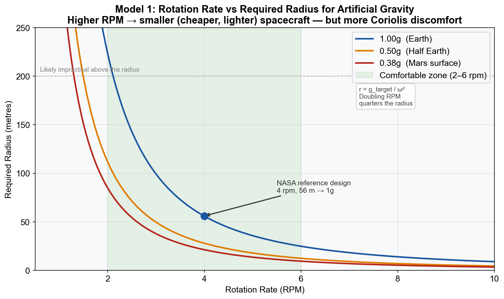
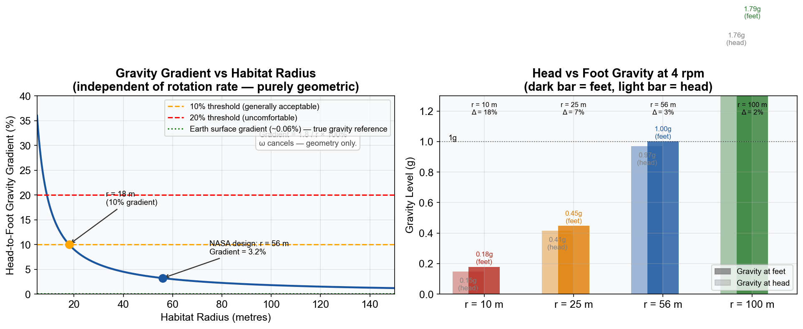
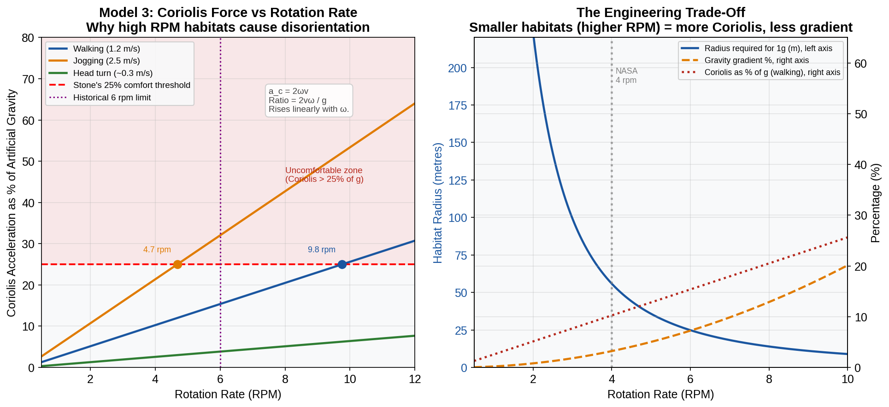
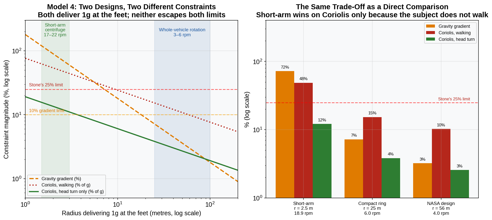

# artificial-gravity-models

Four Python/matplotlib models built for my EPQ,
"Can Artificial Gravity Ever Be Truly Replicated in Spacecraft?"

- Model 1: rotation rate vs required radius (r = 895/n² for 1g)
- Model 2: head-to-foot gravity gradient vs radius (ω cancels out)
- Model 3: Coriolis force vs rotation rate against Stone's 25% comfort threshold
- Model 4: short-arm centrifuge vs whole-vehicle rotation, both delivering 1g at the feet

Models designed and verified by me; implementation and code checking assisted by AI tools.

